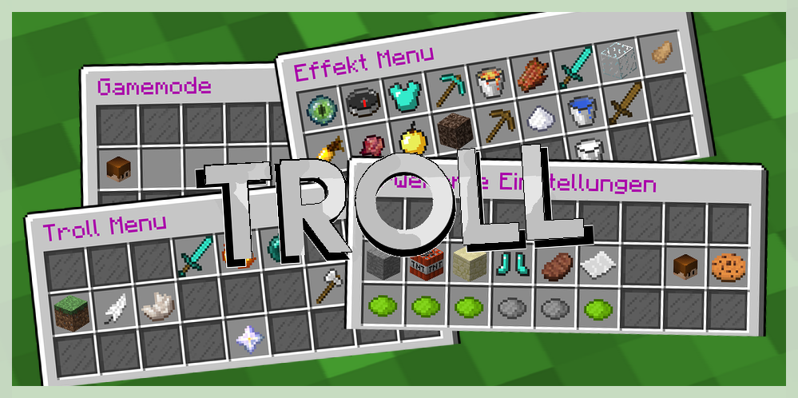
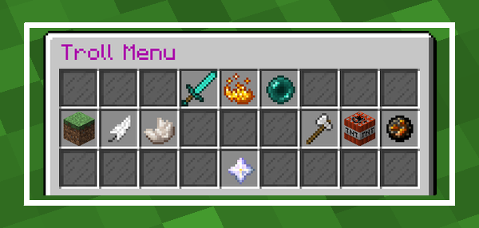
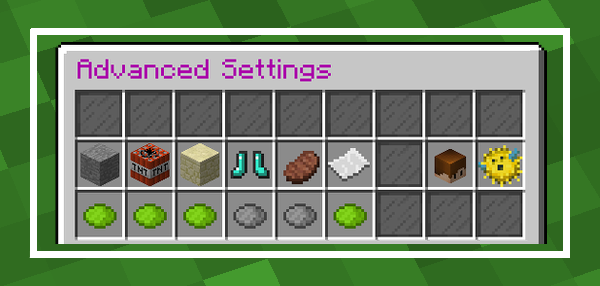
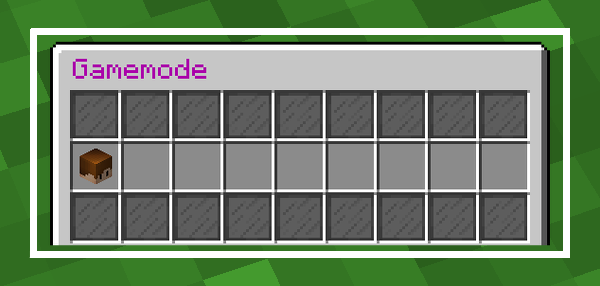
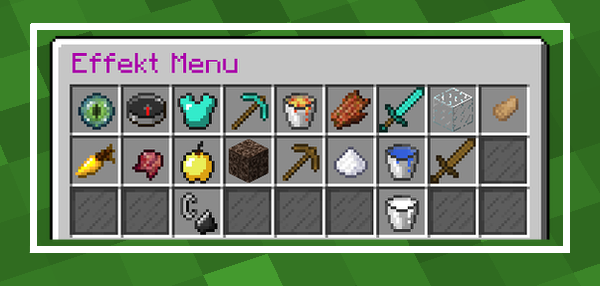

# Troll   

## Table of contents

* [Introduction](#introduction)
* [Features](#features)
* [Screenshots](#screenshots)
* [Contributing](#contributing)
    * [Compilation](#compilation)
    * [PR Policy](#pr-policy)
* [License](#license)

## Introduction

This troll plugin - which is based on that of off a German server, but with even more features - is perfect for having a
fun time with your friends (however, maybe only for you).

With the command `/troll` and the matching permission `troll.use you'll receive the troll item which can be opened with
a right click.

## Features

- **Increase your knockback** to push away other players even further
- With the **invisibility mode**, you will stay hidden forever
- Change the **GameMode** of all players on the server
- **Kill all players** at once
- Give to every player good, as well as bad **status effects**
- **Teleport all players** to you
- Receive special Items:
    - **Thor's hammer** makes lightning strike
    - Look out for the **TNT rain**
    - However, nobody is safe from the **Judgement Day** item!
- Special settings:
    - Prevent the **interaction** with items
    - Switch off **destroying of blocks**
    - Prevent **fall damage**
    - Deactivate the **block damage** by entities, for example from creepers
    - Prevent the **loss of hunger**
    - Toggle the **chat**
- Give the players you trust the **ability to use** the **troll menu**

## Screenshots

### Main Menu

### Advanced Settings

### Gamemode Menu

### Effect Menu

## Contributing

### Compilation

Build with `mvn clean install`.

### PR Policy

I'll accept changes that make sense. You should be able to justify their existence, along with any maintenance costs
that come with them.

## License

This project is licensed under the [BSD 4-Clause License](LICENSE).